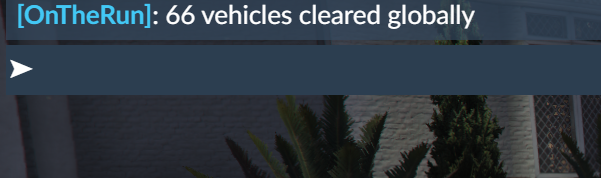
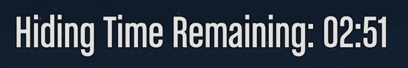
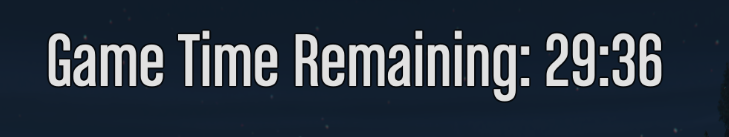
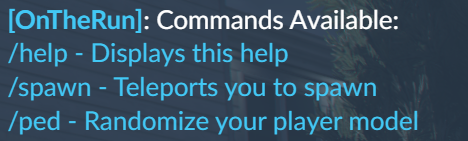

# OTR-FiveM (On the run)
Custom gamemode designed for 2+ players in [FiveM](https://fivem.net/).

Game logic is currently manual.

### Game Rules
There are players on the run that must try and blend into the city to avoid being killed by the hunters before the 30 minute timer is up. 

As the only weapon players are given is an assault rifle, no players can shoot while in their vehicle, meaning shooting can only happen on foot. 

There is a boundary made out of props around the city so the play area isn't impossibly large. (CityGolf_Map) 

#### Hiders (On the run)
1 or a few players are designated as on the run players, you need to do your best to observe how the AI react and drive so you can blend in with them. 

Try to avoid camping as it isn't very fun for either team
You may kill or taunt the hunters at your own risk

If you are a player on the run and you are killed, you are out and can join the hunting team.  

#### Hunters
Hunters must try and identify the players on the run by observing behaviours that are strange or that the AI do not do.

If you are a hunter and are killed, you can just respawn back at the spawn and continue hunting. 

## Server Side Commands:
All server side commands are restricted to admins/owners defined in FiveM config. 
### "clear" 
- Clears all vehicles for all players. 

### "reset"
- Clear all vehicles, moves all players to spawn(golf course) and spawns hunter vehicles.

### "hidetimer"
- Starts and displays a timer at the top center of the screen for 3 minutes.
    - Used to give hiders time to hide 

### "gametimer"
- Starts and displays a timer at the top center of the screen for 30 minutes
    - Used to time the game once hiders' hiding time is up

### "stoptimer"
- Stops any timer that is running

## Client Commands:

### "help"
- Gives list of commands to the player. 

### "spawn"
- Moves player to a random location at the golf course spawn area. 

### "ped"
- Changes player model from set list. 
